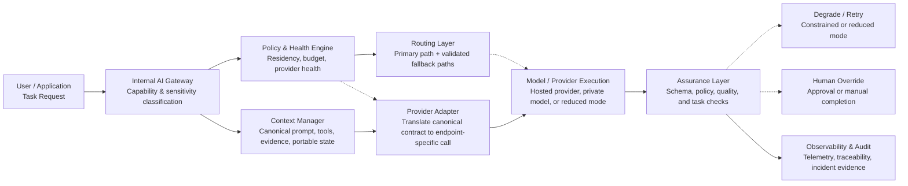

# Enterprise AI Resilience: The Resilience-by-Design AI Control Fabric (RACF) for Multi-Model Continuity, Control, and Governance

**Author:** John Cheung  
**Affiliation:** College of Professional and Continuing Education

## Abstract

Enterprises are rapidly embedding large language models (LLMs) and related generative AI services into customer support, software development, analytics, search, compliance, and internal operations. This creates a new class of operational dependency: core business processes now rely on external model providers, rapidly changing model versions, vendor-specific tool ecosystems, and safety or account-control mechanisms that may behave differently across providers. Traditional resilience patterns such as multi-region deployment or cloud failover are necessary but insufficient because AI failures are not limited to infrastructure downtime; they also include silent quality degradation, tool-use instability, model retirement, policy shifts, quota exhaustion, and control-plane lockout. This paper reviews common approaches to enterprise AI resilience, identifies their limitations, and proposes a new enterprise framework: **Resilience-by-Design AI Control Fabric (RACF)**. RACF treats AI as a governed capability layer rather than a single model integration. It combines policy-based routing, cross-model abstractions, capability-aware fallback, evaluation gates, state portability, human override, and resilience observability. The framework aims to reduce single-provider concentration risk while preserving safety, compliance, and cost discipline.

## Keywords

Enterprise AI resilience, multi-model AI, multi-provider AI, large language models, model orchestration, AI governance, fallback routing, operational resilience, vendor lock-in, Resilience-by-Design AI Control Fabric (RACF)

## 1. Introduction

Organizations increasingly depend on external AI platforms for production workflows. The resulting risk profile differs from conventional software outsourcing in three important ways. First, AI behavior is probabilistic and model-specific: even when two models expose similar APIs, they often produce different reasoning traces, tool-calling behavior, latency, and failure modes. Second, AI providers evolve rapidly through model upgrades, deprecations, safety rule changes, tool semantics, and account controls. Third, many enterprise AI workflows are now *compound systems*: prompts, retrieval, tools, orchestration, guardrails, human review, and model endpoints interact in ways that create new operational coupling.

This matters because AI incidents are no longer hypothetical. Public status pages show significant outages and degraded performance affecting major platforms. OpenAI reported elevated error rates and latency across ChatGPT and API services in June 2025, with API availability dropping materially during the incident [4]. Anthropic publicly documented infrastructure bugs that intermittently degraded Claude response quality, illustrating that AI systems can fail through silent quality defects and not only through total unavailability [6]. Provider status pages and cloud documentation also show a second resilience challenge: model and SDK lifecycles change frequently, and migrations may be required on a deadline to avoid disruption [7][8][9].

For enterprises, the implication is clear: AI resilience is not simply “keep a backup model.” It requires an architectural discipline spanning application design, model selection, governance, evaluation, runtime routing, security, and operating procedures. This paper has three goals:

1. define the enterprise AI resilience problem more precisely;
2. review common mitigation approaches and their limitations; and
3. propose a practical framework for resilient enterprise deployment.

## 2. Background: Why AI Resilience Is Different

### 2.1 Model behavior is not fungible

Two models can share the same high-level task description yet differ materially in instruction following, tool selection, latency distribution, hallucination tendencies, structured output reliability, multilingual performance, refusal patterns, and sensitivity to prompt format. As a result, switching providers is not equivalent to redirecting traffic from one compute cluster to another. Functional compatibility must be engineered.

### 2.2 Failures are multidimensional

AI system failure may appear as:

- hard outage (API unavailable or severe latency),
- soft degradation (higher error rate, slower responses, partial tool failure),
- semantic degradation (lower answer quality, inconsistent reasoning, unsafe or off-policy outputs),
- control-plane failure (account suspension, quota exhaustion, authentication or permission failure),
- lifecycle disruption (model retirement, SDK deprecation, changed endpoint behavior), and
- governance failure (loss of auditability, policy drift, or noncompliant data routing).

### 2.3 Trustworthiness and resilience are linked

NIST's AI Risk Management Framework lists “safe, secure, and resilient” among core characteristics of trustworthy AI [1][2]. In practice, resilience and trustworthiness reinforce each other: an enterprise cannot claim trustworthy AI if business-critical workflows collapse during provider outages, silent regressions, or unmanaged model transitions.

## 3. Common Enterprise Approaches

### 3.1 Single-provider standardization

Many firms standardize on one strategic AI provider to simplify procurement, security review, developer enablement, and vendor management. This approach is attractive because it accelerates adoption and reduces integration sprawl.

**Limitation.** It creates concentration risk. If a single provider suffers outage, quality regression, commercial dispute, quota constraint, or account-control problem, a large fraction of AI-enabled operations may fail simultaneously.

### 3.2 Simple backup model or manual failover

Some teams keep a secondary provider or open-source model and plan to switch manually if the primary service is unavailable.

**Limitation.** Manual failover is too slow for many production workflows and often fails in practice because prompts, tool schemas, output formats, and evaluation expectations are tuned only for the primary model. The backup exists on paper but not as an operationally validated substitute.

### 3.3 API abstraction layer

A growing number of products use a unified gateway or adapter layer so multiple models can be invoked through one internal interface.

**Limitation.** Interface abstraction alone is insufficient. It hides endpoint differences but not capability differences. Tool-use conventions, context windows, safety behavior, JSON adherence, and long-horizon agent performance may still diverge sharply.

### 3.4 Model portfolio by use case

More mature organizations map tasks to different models: one for coding, one for summarization, one for enterprise search, one for on-premise confidential inference, and so on.

**Limitation.** This improves fit-for-purpose performance but can increase governance complexity, fragment telemetry, and make resilience harder if each application team optimizes locally without enterprise-wide standards.

### 3.5 Open-source hedge

Some enterprises retain self-hosted or private-cloud models as a hedge against vendor dependency.

**Limitation.** Open-source deployment improves sovereignty but does not automatically solve resilience. Self-hosted stacks have their own risks: GPU capacity constraints, slower patching, weaker tool ecosystem maturity, and potentially lower task quality for complex enterprise workflows.

## 4. A Review of Key Limitations in Current Practice

### 4.1 Resilience is treated as provider redundancy, not workflow continuity

Enterprises often measure resilience by asking whether another model endpoint exists. The better question is whether the *business workflow* can continue acceptably under degraded conditions. A customer support assistant may fall back from agentic tool use to retrieval-only mode; a coding assistant may fall back from autonomous editing to advisory review; a document drafting workflow may degrade to human-in-the-loop mode. Resilience should therefore be defined at multiple operating levels.

### 4.2 Fallback rarely preserves state

AI applications often hold state in prompts, hidden system instructions, provider-specific tool sessions, conversation history, scratchpads, or temporary memory stores. When switching providers, much of this state is lost or becomes semantically unstable. Without state portability, failover can create a second failure at the application layer.

### 4.3 Evaluation is not integrated into runtime control

Most organizations run offline benchmarks before procurement or model rollout. Few wire evaluation results into routing, escalation, or release gates. This means known weak spots do not directly influence traffic decisions during live incidents.

### 4.4 Governance and operations are separated

Security, legal, procurement, and platform engineering often operate in parallel rather than through a unified control plane. As a result, contract terms, data routing constraints, model lifecycle notices, fallback policies, and runbooks are not encoded into the live system.

## 5. The RACF Framework

The proposed **Resilience-by-Design AI Control Fabric (RACF)** is an enterprise architecture pattern for AI continuity. RACF is not a single product. It is a layered control fabric that separates business workflows from provider-specific implementations while preserving policy enforcement and runtime assurance.

### 5.1 Layer 1: Capability decomposition

Instead of treating “AI” as one monolithic service, RACF decomposes workloads into named capabilities such as retrieval-grounded answering, structured extraction, summarization, classification, code generation, tool orchestration, and workflow planning. Each capability has explicit quality thresholds, safety constraints, and degradation options.

### 5.2 Layer 2: Canonical task contract

Applications do not call provider APIs directly. They invoke an internal canonical contract that defines:

- task type,
- input schema,
- tool privileges,
- evidence or retrieval requirements,
- expected output structure,
- sensitivity level,
- business criticality, and
- allowed fallback modes.

This contract reduces provider lock-in and makes policy decisions explicit.

### 5.3 Layer 3: Capability-aware model registry

Each model or provider is registered against validated capability profiles rather than generic labels such as “primary” or “backup.” The registry includes:

- supported capabilities,
- approved data classes,
- region or residency constraints,
- quality envelope,
- latency and cost profile,
- tool compatibility,
- lifecycle status, and
- evaluation scores by task family.

A backup model is not globally “secondary”; it is secondary *for a named capability under a defined operating mode*.

### 5.4 Layer 4: Policy-based routing and graded degradation

Requests are routed according to business criticality, sensitivity, workload type, current provider health, and validated capability coverage. RACF supports multiple degradation modes:

1. **Full mode:** primary model, full tools, autonomous or near-autonomous behavior.
2. **Constrained mode:** primary or alternate model with tighter tool permissions and stricter schema requirements.
3. **Reduced mode:** retrieval-only or advisory mode without autonomous action.
4. **Fallback mode:** alternate provider or local model for minimum viable continuity.
5. **Human override:** workflow continues with human approval or manual execution.

This treats resilience as graceful degradation rather than binary failover.

### 5.5 Layer 5: State portability

All portable context—instructions, retrieved evidence, task plan, tool results, and user-approved memory—is stored in enterprise-managed state containers instead of provider-exclusive sessions whenever possible. Provider-specific traces may still exist, but the minimum recoverable working set remains exportable and replayable.

### 5.6 Layer 6: Evaluation gates and live assurance

RACF uses two evaluation loops. The *release loop* validates new models, prompts, and tool configurations before production rollout. The *runtime loop* continuously scores outputs using lightweight quality signals such as schema validity, grounded citation coverage, policy conformance, retry rate, human correction rate, and task success. Routing decisions can downshift traffic when live assurance drops below policy thresholds.

### 5.7 Layer 7: Resilience observability

The framework adds AI-native telemetry to standard SRE monitoring. Recommended dashboards include:

- provider availability and latency by capability,
- tool-call success rate and timeout profile,
- structured-output pass rate,
- fallback activation rate,
- semantic defect proxies,
- cost per successful task,
- model-version traffic distribution, and
- account and quota-control events.

Incident response should distinguish infrastructure failure, semantic failure, tool failure, and governance failure.

### 5.8 Layer 8: Human and governance control plane

Enterprises need a control plane spanning technology, policy, and operations. This includes emergency provider disablement procedures, approval workflows for model lifecycle changes, contractual requirements for exportability and notice periods, and tabletop exercises for AI-specific incidents. In other words, resilience is also an organizational capability.

## 6. Reference Architecture

The RACF reference architecture can be described as follows. The Mermaid diagram below is GitHub-friendly and reflects the cleaned flow used in the revised manuscript.

1. User or application sends a task request to an internal AI gateway.
2. The gateway classifies the request by capability, sensitivity, criticality, and tool needs.
3. Policy engine checks allowed providers, residency, budget, and current health state.
4. Router selects primary model path plus one or more validated fallback paths.
5. Context manager assembles canonical prompt, retrieved evidence, tool schemas, and portable state.
6. Execution layer invokes the chosen provider adapter.
7. Assurance layer validates schema, policy, and task-level signals.
8. If checks fail, the request is retried in a lower operating mode, rerouted, or escalated to a human.
9. All decisions and artifacts are logged to observability and audit systems.

## 7. Implementation Roadmap

### 7.1 Phase 1: Inventory and classification

Catalog all AI-enabled workflows, providers, models, tools, and data paths. Identify business-critical workflows and classify them by continuity requirement. A common early finding is that organizations do not know which processes would stop if a single provider became unavailable.

### 7.2 Phase 2: Canonical contract and registry

Create the enterprise prompt/tool/schema contract and a model registry. Standardize trace IDs, safety labels, and response envelopes. This phase establishes the minimum architecture required for portability.

### 7.3 Phase 3: Dual-path validation

For each critical capability, validate at least one alternate path under realistic test conditions. The alternate path may be another hosted provider, a private-cloud model, or a reduced-function workflow.

### 7.4 Phase 4: Live routing and assurance

Introduce health-aware routing, runtime checks, and degradation modes. Start with non-autonomous use cases before extending to agentic workflows.

### 7.5 Phase 5: Governance and exercises

Adopt model lifecycle review, procurement clauses, resilience KPIs, and incident exercises. Include scenarios such as provider outage, model retirement, provider-side safety policy changes, account lock, and semantic quality regression.

## 8. Evaluation Criteria

An enterprise resilience program should measure more than uptime. Suggested metrics include:

- **Task continuity rate:** percentage of critical workflows that complete under primary failure.
- **Quality-preserving failover rate:** proportion of failovers meeting minimum acceptance thresholds.
- **Fallback readiness coverage:** percentage of critical capabilities with tested alternate paths.
- **Portable state coverage:** proportion of workflows whose minimum recoverable state is enterprise-controlled.
- **Mean time to degrade safely:** time from incident onset to policy-compliant reduced mode.
- **Model lifecycle exposure:** share of production traffic on near-retirement or deprecated dependencies.
- **Human override load:** additional human effort required during degraded operation.

## 9. Discussion

RACF does not eliminate the trade-offs in enterprise AI. Multi-provider design can increase complexity, cost, and governance overhead. Some capabilities will remain strongly model-specific, especially frontier agentic coding, multimodal workflows, or specialized tool ecosystems. In some cases, strict portability may reduce the benefit of provider-native features.

However, the alternative—deep dependence on one provider without a tested continuity design—is increasingly risky. Public evidence already shows outages, silent quality defects, and frequent model or SDK lifecycle changes across the ecosystem [3][5][6][8][9]. As enterprises move from experimentation to operational dependence, resilience must be treated as a first-class architectural requirement.

## 10. Conclusion

AI resilience in the enterprise is not simply redundancy at the endpoint layer. It is the ability to maintain trustworthy, policy-compliant business operation despite provider outages, behavioral divergence, lifecycle churn, and control-plane shocks. Common approaches such as single-provider standardization, informal backups, or thin API abstraction reduce friction but leave major continuity gaps.

The proposed Resilience-by-Design AI Control Fabric reframes the problem around capability decomposition, canonical contracts, capability-aware model registries, graded degradation, state portability, runtime assurance, resilience observability, and governance control. This provides a practical path for enterprises that want to scale AI adoption without accepting brittle dependence on a single model-provider stack. Future work should extend the framework with formal resilience test suites, vendor-neutral interoperability standards, and sector-specific reference controls for regulated industries.

## References

1. National Institute of Standards and Technology. *Artificial Intelligence Risk Management Framework (AI RMF 1.0).* NIST AI 100-1, 2023. <https://nvlpubs.nist.gov/nistpubs/ai/nist.ai.100-1.pdf>
2. National Institute of Standards and Technology. *AI Risks and Trustworthiness.* NIST AI Resource Center. <https://airc.nist.gov/airmf-resources/airmf/3-sec-characteristics/>
3. OpenAI. *OpenAI Status.* <https://status.openai.com/>
4. OpenAI. *Elevated error rates.* OpenAI Status incident report, June 10, 2025. <https://status.openai.com/incidents/01JXCAW3K3JAE0EP56AEZ7CBG3>
5. Anthropic. *Claude Status.* <https://status.anthropic.com/>
6. Anthropic. *A postmortem of three recent issues.* Anthropic Engineering, September 17, 2025. <https://www.anthropic.com/engineering/a-postmortem-of-three-recent-issues>
7. Anthropic. *Models overview.* Claude API Docs. <https://docs.anthropic.com/en/docs/about-claude/models>
8. Google Cloud. *Generative AI on Vertex AI deprecations.* <https://docs.cloud.google.com/vertex-ai/generative-ai/docs/deprecations>
9. Microsoft. *Azure OpenAI in Microsoft Foundry Model Retirements.* <https://learn.microsoft.com/en-us/azure/foundry/openai/concepts/model-retirements>
